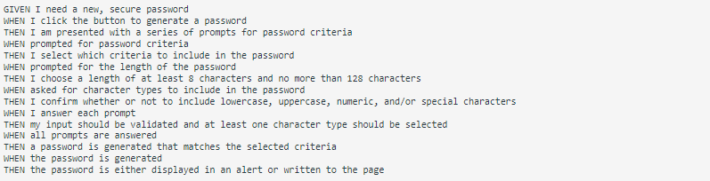

# passGen
Repository for module 3 challenge assignment

# JavaScript Challenge: Password Generator

This week's Challenge required me to create a application that a employee can use to generate a random password based on criteria they've selected. This app will run in the browser, and will feature dynamically updated HTML and CSS powered by JavaScript code that I write. It will have a clean and polished user interface that is responsive, ensuring that it adapts to multiple screen sizes. The password can include special characters.

# User Story

AS AN employee with access to sensitive data
I WANT to randomly generate a password that meets certain criteria
SO THAT I can create a strong password that provides greater security

# Acceptance Criteria

# Mock-up

# Deployed application

https://c-johnson83.github.io/passGen/